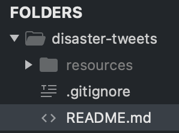

# Natural Language Processing with Disaster Tweets
Abdullah Bera\
Michael Kori\
Brian Moore\
Yae Jin Park

## Overview
Reasons for choosing the topic
Questions we hope to answer
Data source
Data description

## Questions We Hope to Answer

## Data Source and Description

Kaggle provided three .csv datasheets for this topic - train.csv, test.csv, and sample_submission.csv. As their names imply, these are datasheets for users to train and test their model with, and also compare the final results of testing with the sample_submission.csv if the users decide to participate in the competition. 

*Note: The mentioned data files are not included in this repository. Please download them from [the competition link in Kaggle](https://www.kaggle.com/c/nlp-getting-started/data) and place them in a folder named 'resources.' If you don't have this folder, you can manually create one. The folder directory should look like the following:*




## Database

Kaggle challenge files test.csv and train.csv imported to PostgreSQL database for use in Jupyter. 

 - Schema image for test and train tables: [schema image](resources/schema.png)
 - Schema file for test and train tables: [schema.sql](resources/schema.sql)

Importing the original kaggle datasets into PostgreSQL was problematic due to the inherent multi-line tweets including line feeds without carriage returns. Process utilized to import the data as follows:
1.  Utilizing Microsoft Excel or a similar program open the CSV file.
2.  Delete the header row. pgAdmin doesn't have the option to view the first row in a text file as a header row.
3.  Use the Save As option to save the file in text format, this converts the comma separated value into a tab delimited file and adds carriage returns at the end of each row.
4.  Using Notepad++ or a similar text editor that displays End of Line symbols (using the "Extended Search" mode for Notepad++) in the Replace window:
    - Do a replace all on "\n" to " ". This removes all line feeds and keeps the text of the tweets intact, but it also adds a space after each carriage return.
    - Do a replace all on "\r " to "\r". This removes the extra space after the added carriage returns added by Excel.
    - This creates a consistent format throughout the file that pgAdmin can interpret based on the first row. A carriage return is sufficient, adding the line feed back is not necessary.
5.  test.txt is now ready, though train.txt requires one additional change.
6.  Line 3087 in train.txt the tweet includes characters that are interpreted as regex that will throw an error in pgAdmin during a table import. This can be resolved in one of two ways:
    - Remove the rows containing such characters.
    - Encapsulate the tweet in quotes. The row of data should be the following:
```
4428	electrocute		"@lightseraphs pissed at you and could have their pikachu electrocute you and :\\\"	0
```
7.  Since it was just a single row quotes were added to keep all training data. If such errors were replicated throughout manually editing wouldn't be recommended.
8.  In pgAdmin import the .txt file with the following settings:
    - Format - text
    - Delimiter - [tab]

Versions used in import:
 - Microsoft Excel Home and Student 2019, Version 2108(Build 14326.20238 Click-to-Run)
 - Notepad++ Version 7.9.5
 - pgAdmin 4 Version 5.2

## Technologies
Jupyter
Python
PostgreSQL
