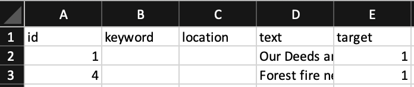

# Natural Language Processing with Disaster Tweets
Abdullah Bera\
Michael Kori\
Brian Moore\
Yae Jin Park

## Reasons for Choosing the Topic

One of the most consequential threats humans are facing today is concerning disinformation. With the popularity of social media platforms, conducting disinformation never has been this easy. We wanted to join this Kaggle competition to build a meaningful Machine Learning model that will help us classify between Tweets that actually remark a disaster and not. Furthermore, we wanted to delve into the field of NLP within Machine Learning; and we found this is a great challenge to get started implementing what we learned about NLP. The conclusions we provide here will help agencies programmatically monitor Twitter for disasters. We believe that when technology is used for good, then will the future be built for the betterment of the common good.

## Questions We Hope to Answer

- Can we successfully distinguish tweets that are actually related to disasters from those that are not?
- If "yes" to the question above, what are some NLP techniques (or others) that can improve the prediction model?
- Demonstrating said techniques for model's improvement

## Data Source and Description

Kaggle provided three .csv datasheets for this topic - train.csv, test.csv, and sample_submission.csv. As their names imply, these are datasheets for users to train and test their model with, and also compare the final results of testing with the sample_submission.csv if the users decide to participate in the competition. 

*Note: The mentioned data files are not included in this repository. Please download them from [the competition link in Kaggle](https://www.kaggle.com/c/nlp-getting-started/data) and place them in a folder named 'resources.' If you don't have this folder, you can manually create one. The folder directory should look like the following:*


The train.csv datasheet should have the following columns (beneath A, B, C, D, E):



 - id: The numerical ids of the tweets in the datasheet
 - keyword: Any single keyword mentioned in the tweet that is related to the accident - some rows do not have any keywords data.
 - location: Location where this tweet was posted - some rows do not have any locations data. The location can be any of the following: latitude/longitude pair, country name, city name, junk text (e.g. any text that does not provide information of the location), or combination of two or more of the types.
 - text: The text content of the tweet 
 - target: 0 or 1 indicating whether the tweet is indeed about a disaster or not.

The test.csv looks similar to train.csv, but is missing the target column. This is expected because the model should predict if each rows of tweets in the test.csv are related to disasters or not.


## Machine Learning

Train.csv data categorizes the results with a 0 (not a disaster tweet) or 1 (a tweet about a real disaster). The test.csv and train.csv files are imported into postgreSQL and the database then is accessed using Jupyter Notebook where the data is preprocessed, a model is created and stored based on samples of training data using Clf, validated on further training data, and then used to predict test values based on the stored weight. Additional methodologies will be explored and if successfully implemented, compared against the results utilizing Clf.


## Database

Kaggle challenge files test.csv and train.csv imported to PostgreSQL database for use in Jupyter. 

 - Schema image for test and train tables: [schema image](resources/images/schema.png)
 - Schema file for test and train tables: [schema.sql](resources/schema.sql)

Importing the original kaggle datasets into PostgreSQL was problematic due to the inherent multi-line tweets including line feeds without carriage returns. Process utilized to import the data as follows:
1.  Utilizing Microsoft Excel or a similar program open the CSV file.
2.  Delete the header row. pgAdmin doesn't have the option to view the first row in a text file as a header row.
3.  Use the Save As option to save the file in text format, this converts the comma separated value into a tab delimited file and adds carriage returns at the end of each row.
4.  Using Notepad++ or a similar text editor that displays End of Line symbols (using the "Extended Search" mode for Notepad++) in the Replace window:
    - Do a replace all on "\n" to " ". This removes all line feeds and keeps the text of the tweets intact, but it also adds a space after each carriage return.
    - Do a replace all on "\r " to "\r". This removes the extra space after the added carriage returns added by Excel.
    - This creates a consistent format throughout the file that pgAdmin can interpret based on the first row. A carriage return is sufficient, adding the line feed back is not necessary.
5.  test.txt is now ready, though train.txt requires one additional change.
6.  Line 3087 in train.txt the tweet includes characters that are interpreted as regex that will throw an error in pgAdmin during a table import. This can be resolved in one of two ways:
    - Remove the rows containing such characters.
    - Encapsulate the tweet in quotes. The row of data should be the following:
```
4428	electrocute		"@lightseraphs pissed at you and could have their pikachu electrocute you and :\\\"	0
```
7.  Since it was just a single row quotes were added to keep all training data. If such errors were replicated throughout manually editing wouldn't be recommended.
8.  In pgAdmin import the .txt file with the following settings:
    - Format - text
    - Delimiter - [tab]

Versions used in import:
 - Microsoft Excel Home and Student 2019, Version 2108(Build 14326.20238 Click-to-Run)
 - Notepad++ Version 7.9.5
 - pgAdmin 4 Version 5.2

## Communication Protocols 

We will be using a combination of the following to maintain communication and keep on schdule:

* Google Docs to share and store information outside of Github (Roles, Plans, Updates) 
* Github with individual branches in order to post code and update the ReadMe
* Weekly meetings to discuss updates, problems, plans and roles for the upcoming week 
* Slack to communicate with eachother, ask questions, get help, etc. 

## Technologies
Jupyter\
Python\
PostgreSQL